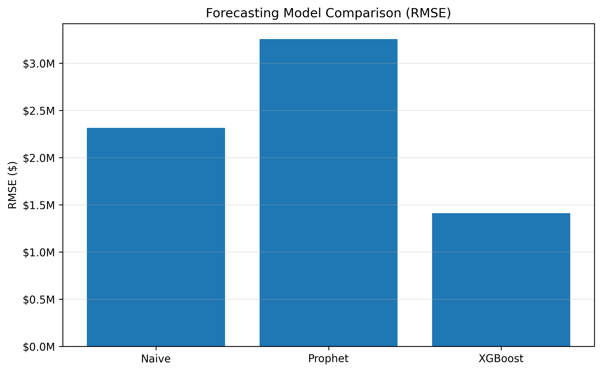
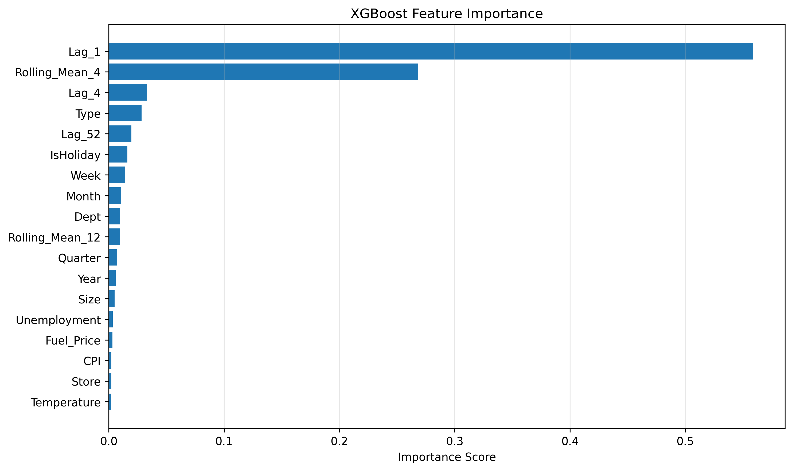

# Retail Sales Forecasting

## Project Overview

This project develops an end-to-end retail sales forecasting pipeline using Walmart historical sales data. The objective is to predict future weekly sales by combining exploratory data analysis, feature engineering, and multiple forecasting techniques.

Three forecasting approaches are evaluated:

- Naïve baseline (last week's sales)
- Facebook Prophet
- XGBoost with engineered features

Model performance is evaluated using Mean Absolute Error (MAE) and Root Mean Squared Error (RMSE). Hyperparameter tuning is performed using GridSearchCV to optimize the final XGBoost model, and feature importance analysis is used to interpret the model's predictions.

---

## Business Problem

Accurate retail sales forecasts help businesses make informed decisions regarding inventory management, staffing, budgeting, and supply chain planning. Poor forecasts can lead to excess inventory, stock shortages, and missed revenue opportunities.

The goal of this project is to develop forecasting models capable of predicting weekly Walmart sales while incorporating historical sales behavior, seasonality, holidays, and external economic factors.

---

## Dataset

The project uses the Walmart Recruiting: Store Sales Forecasting dataset from Kaggle.

The data includes:

- Historical weekly sales
- Store information
- Holiday indicators
- Fuel prices
- Consumer Price Index (CPI)
- Unemployment rates
- Store size and type

After merging the datasets, additional predictive features were engineered to improve forecasting performance.

---

## Repository Structure

```
retail-sales-forecasting/
│
├── data/
│   ├── features.csv
│   ├── stores.csv
│   ├── train.csv
│   └── test.csv
│
├── notebooks/
│   ├── 01_eda_and_feature_engineering.ipynb
│   ├── 02_forecasting_models.ipynb
│   └── 03_model_tuning_and_interpretation.ipynb
│
├── src/
├── visuals/
├── README.md
├── requirements.txt
└── .gitignore
```

---

## Notebooks

The project is organized into three Jupyter notebooks that document the complete forecasting workflow.

- 📓 [**01 - EDA and Feature Engineering**](notebooks/01_eda_and_feature_engineering.ipynb)
  - Data loading and merging
  - Exploratory data analysis
  - Feature engineering
  - Data preparation

- 📓 [**02 - Forecasting Models**](notebooks/02_forecasting_models.ipynb)
  - Chronological train/test split
  - Naïve baseline
  - Prophet
  - XGBoost
  - Model comparison

- 📓 [**03 - Model Tuning and Interpretation**](notebooks/03_model_tuning_and_interpretation.ipynb)
  - Hyperparameter tuning
  - Optimized XGBoost
  - Feature importance
  - Model interpretation

---

## Methodology

The project follows a complete machine learning workflow:

1. Data loading and merging
2. Exploratory data analysis
3. Data quality assessment
4. Feature engineering
    - Calendar features
    - Lag features
    - Rolling averages
5. Chronological train/test split
6. Baseline forecasting model
7. Prophet forecasting model
8. XGBoost forecasting model
9. Hyperparameter tuning using GridSearchCV
10. Feature importance analysis

---

## Results

Three forecasting models were compared on the same hold-out test period.

| Model | MAE | RMSE |
|------|---------:|---------:|
| Naïve Baseline | $1,590,068 | $2,314,371 |
| Prophet | $2,915,925 | $3,255,605 |
| XGBoost | **$1,122,420** | **$1,411,355** |

The optimized XGBoost model achieved the best overall forecasting performance.



---

## Key Findings

- XGBoost produced the lowest forecasting error among the evaluated models.
- Engineered lag features were the most influential predictors.
- Rolling average features substantially improved model performance.
- Holiday effects contributed to sales variation but were less influential than recent sales history.
- The naïve baseline performed surprisingly well, highlighting the persistence of weekly sales patterns.
- Prophet underperformed relative to XGBoost, likely due to the relatively short training period and limited seasonal history.



---

## Technologies Used

- Python
- Pandas
- NumPy
- Matplotlib
- Prophet
- XGBoost
- Scikit-learn
- GridSearchCV
- Jupyter Notebook

---

## Future Improvements

Potential future enhancements include:

- Additional hyperparameter optimization using RandomizedSearchCV or Bayesian optimization
- TimeSeriesSplit cross-validation
- LightGBM and CatBoost model comparisons
- SHAP values for model interpretability
- Recursive multi-step forecasting
- Store-specific forecasting models
- Deep learning approaches such as LSTM or Temporal Fusion Transformers

---

## Author

Benjamin Harris

Data Scientist